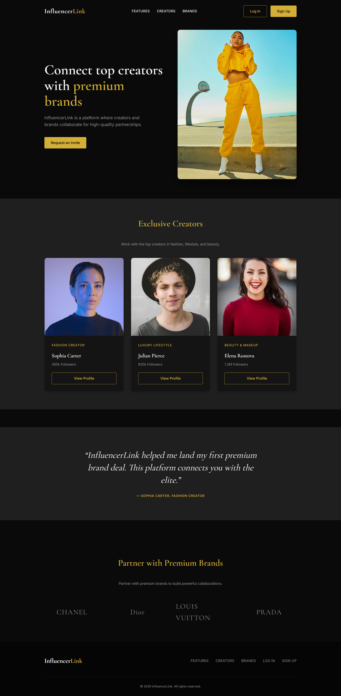
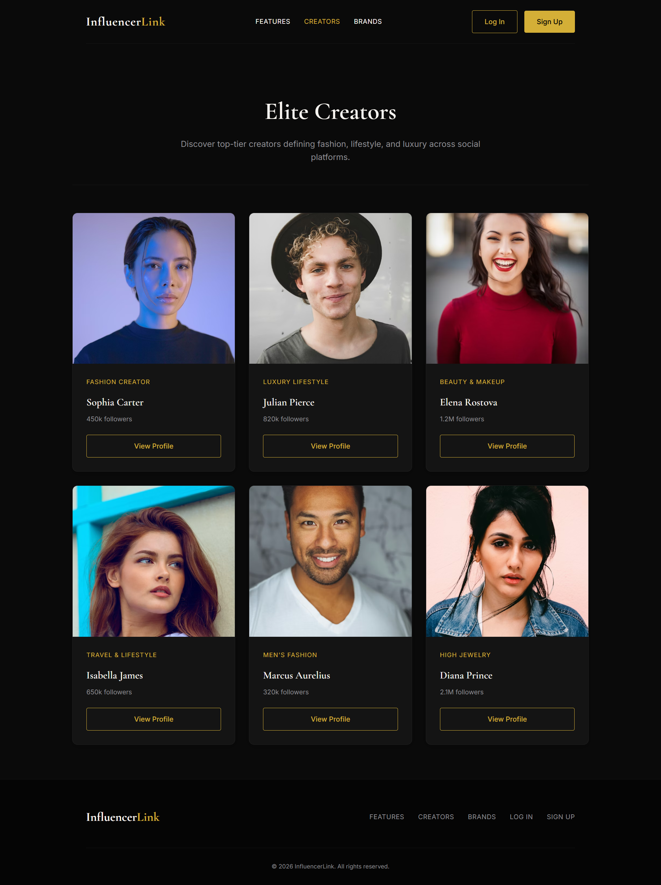
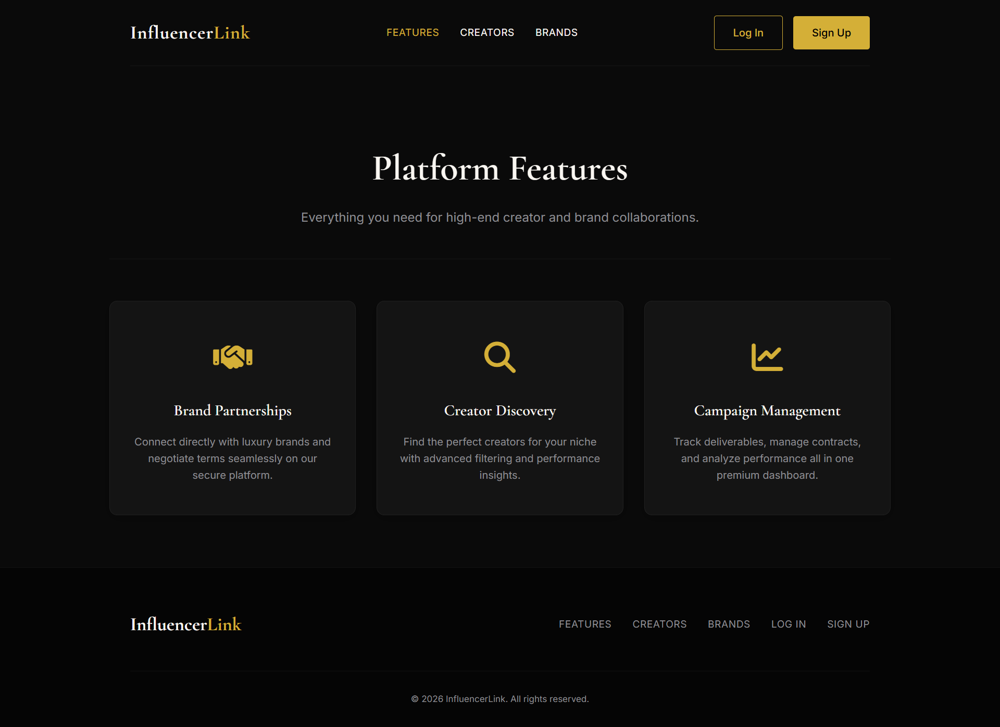
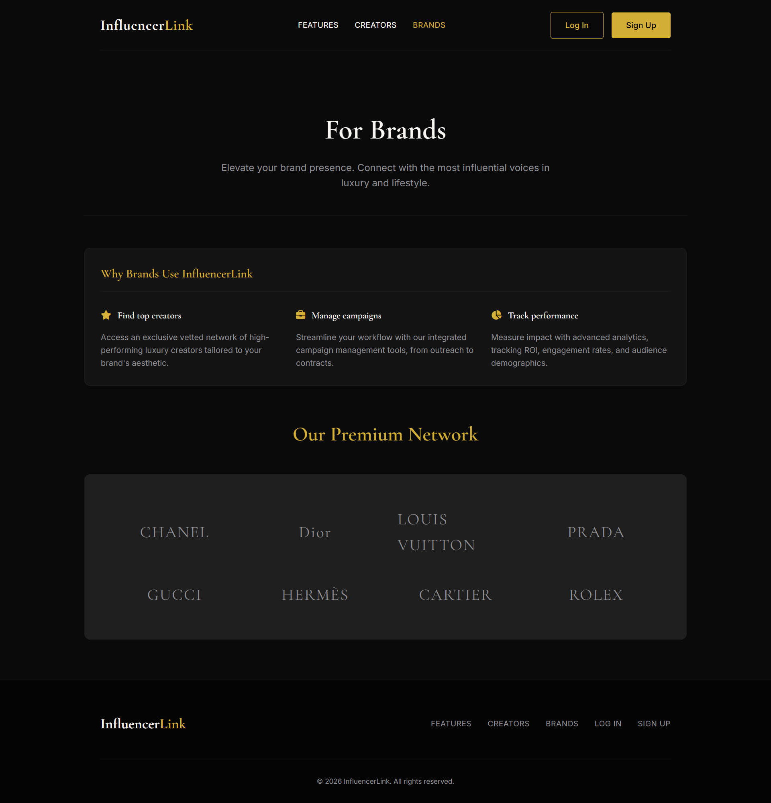

# InfluencerLink

InfluencerLink is a responsive, multi-page web application designed with a dark, premium luxury aesthetic. It serves as a mock platform designed to connect top-tier creators with premium brands for high-quality partnerships.

## 🚀 Features

- **Home Page (`index.html`)**: Features a premium hero section, exclusive creator highlights, testimonials, and premium brand partner logos.
- **Features Page (`features.html`)**: Outlines the core benefits of the platform such as Brand Partnerships, Creator Discovery, and Campaign Management.
- **Creators Page (`creators.html`)**: A responsive grid showcasing top-tier creator profiles with their niches and follower counts.
- **Brands Page (`brands.html`)**: Details the benefits for brands and displays a grid of luxury brand partners.
- **Authentication Pages**: Clean and simple `login.html` and `signup.html` pages for users to request invites or access their accounts.

## 🎨 Design & Aesthetics
- **Color Palette**: Dark mode aesthetic featuring deep blacks (`#0A0A0A`), sleek surface greys (`#141414`), prominent gold accents (`#D4AF37`), and clean white text (`#FAF7F2`).
- **Typography**: Uses `Cormorant Garamond` for elegant serif headings and `Inter` for clean, readable sans-serif body text.
- **Layout**: Built strictly using modern Flexbox and CSS Grid layout techniques without relying on external frameworks.

## 🛠️ Technologies Used

- **HTML5**: For semantic page structure.
- **CSS3**: For styling, responsive design (Flexbox/Grid), custom variables, and hover effects.
- **No JavaScript**: The current version relies exclusively on HTML/CSS for its functionality and links.

## 📸 Screenshots

### Home Page


### Creators Platform


### Features


### Brands


## 📁 Folder Structure

```
InfluencerLink/
│
├── index.html
├── creators.html
├── brands.html
├── features.html
├── login.html
├── signup.html
│
├── css/
│   └── style.css
│
└── images/
    ├── creator1.jpg (Optional local image)
    ├── creator2.jpg (Optional local image)
    ├── creator3.jpg (Optional local image)
    └── ...
```


## 💻 How to Run

Because this project is built with static HTML and CSS, no build steps or servers are required. 

1. Clone or download this repository.
2. Navigate to the project folder.
3. Open `index.html` directly in your favorite web browser (Chrome, Firefox, Safari, Edge, etc.).


